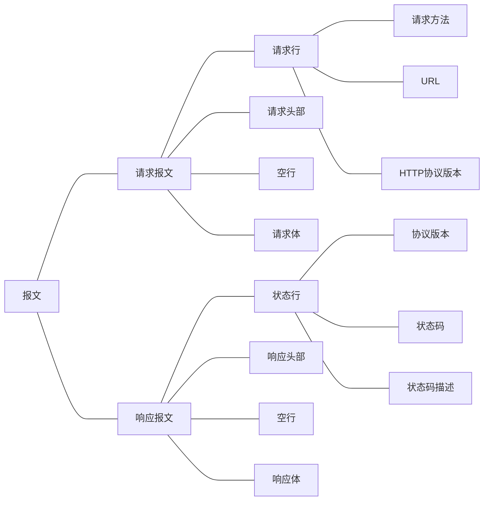

## HTTP

HTTP 是超文本传输协议，基于 TCP 协议。

**报文结构**




**请求常用部首**

- User-Agent：产生请求的浏览器类型;标志客户程序
- Accept：客户端可识别的响应内容类型列表;星号 “ * ” 用于按范围将类型分组，用 “ */* ” 指示可接受全部类型，用“ type/* ”指示可接受 type 类型的所有子类型;
- Accept-Language：客户端可接受的自然语言;
- Accept-Encoding：客户端可接受的编码压缩格式;
- Accept-Charset：可接受的应答的字符集;
- Host：请求的主机名，允许多个域名同处一个IP 地址，即虚拟主机;
- connection：连接方式(close 或 keepalive);
- Cookie：存储于客户端扩展字段，向同一域名的服务端发送属于该域的cookie;

- Authorization：可以存放token，用于验证信息


**响应常用部首**

- Location：Location响应报头域用于重定向接受者到一个新的位置。例如：客户端所请求的页面已不存在原先的位置，为了让客户端重定向到这个页面新的位置，服务器端可以发回Location响应报头后使用重定向语句，让客户端去访问新的域名所对应的服务器上的资源;

- Server：Server 响应报头域包含了服务器用来处理请求的软件信息及其版本。它和 User-Agent 请求报头域是相对应的，前者发送服务器端软件的信息，后者发送客户端软件(浏览器)和操作系统的信息。
- Content-Length  给出文档长度
- Content-type 给出媒体类型
- Vary：指示不可缓存的请求头列表;
- Connection：连接方式；对于请求来说：close(告诉WEB 服务器或者代理服务器，在完成本次请求的响应后，断开连接，不等待本次连接的后续请求了)。keepalive(告诉WEB服务器或者代理服务器，在完成本次请求的响应后，保持连接，等待本次连接的后续请求);对于响应来说：close(连接已经关闭); keepalive(连接保持着，在等待本次连接的后续请求); Keep-Alive：如果浏览器请求保持连接，则该头部表明希望WEB 服务器保持连接多长时间(秒);例如：Keep-Alive：300;
- WWW-Authenticate：WWW-Authenticate响应报头域必须被包含在401 (未授权的)响应消息中，这个报头域和前面讲到的Authorization 请求报头域是相关的，当客户端收到 401 响应消息，就要决定是否请求服务器对其进行验证。如果要求服务器对其进行验证，就可以发送一个包含了Authorization 报头域的请求;


**HTTP 协议的连接过程**

- **请求 TCP 连接**
  首先，浏览器与 Web 服务器的 HTTP 80端口建立一个 TCP 套接字连接。

- **发送 HTTP 请求**

  通过 TCP 连接，浏览器向服务器发送一个文本的请求报文，一个请求报文由请求行、请求头部、空行和请求数据组成。

- **接受请求返回响应**

  Web服务器解析请求，定位请求资源。服务器将资源复本写到 TCP 套接字，由浏览器读取。一个响应由状态行、响应头部、空行和响应数据组成。

- **释放TCP连接**

  若 connection 模式为 close，则服务器主动关闭TCP连接，客户端被动关闭连接，释放 TCP 连接

  若connection 模式为 keepalive，则该连接会保持一段时间，在该时间内可以继续接收请求。

- **解析 HTML 内容**

  浏览器首先解析状态行，查看表明请求是否成功的状态代码。然后解析每一个响应头，响应头告知以下为若干字节的HTML文档和文档的字符集。客户端浏览器读取响应数据HTML，根据HTML的语法对其进行格式化，并在浏览器窗口中显示。

**HTTP协议的头部属性**

- 通用信息头

  - Request URL 请求的地址 域名
    Request Method 请求的方法类型 GET / POST
    Status Code 响应状态码 200 OK / 404 NOT-FOUND
    Remote Address 表示远程服务器地址 IP地址

- 响应头

  - Content-Length 响应体的长度

    Content-type 返回的响应MIME类型与编码:告诉浏览器它发送的数据属于什么文件类型

    Cache-control 指定请求和响应遵循的缓存机制

    - public 响应可被任何缓存区缓存
      private 对于单个用户的整个或部分响应消息，不能被共享缓存处理
      no-cache 表示请求或响应消息不能缓存

- 请求头

  - Accept 告诉服务器可以接受的文件格式。
    Accept-Encoding gzip等指定浏览器可以支持的web服务器返回的内容压缩编码类型。
    Accept-Language 浏览器支持的语言。
    Cache-Control 指定请求和响应遵循的缓存机制。
    Connection keep-alive 表示是否需要持久连接。
    Cookie HTTP请求发送时，会把保存在该请求域名下的所有 cookie 值一起发送给web服务器。
    Host 指定请求的服务器的域名和端口号。
    Referer 告诉服务器是从哪个网站链接过来的。
    User-Agent 简称UA。内容包含发出请求的用户信息。
    Authorization 当客户端访问受口令保护时，服务器端会发送401状态码和 www-authenticate 响应头，要求客户机使用 Authorization 来应答。


## HTTPS

[HTTPS为什么安全 &分析 HTTPS 连接建立全过程](https://wetest.qq.com/lab/view/110.html)


非对称加密算法（**公钥和私钥**）交换对称密钥+数字证书验证身份（**验证公钥是否是伪造的**）+利用**对称密钥**加解密后续传输的数据=**安全**

## TCP

TCP（Transmission Control Protocol，传输控制协议）是面向连接的协议。

### 三次握手

TCP 需要 seq 序列号来做可靠重传或接收，而避免连接复用时无法分辨出 seq 是延迟或者是旧链接的 seq，因此需要三次握手来约定**确定双方的 ISN**（初始 seq 序列号）。

> 1) A --> B  SYN my sequence number is X
> 2) A <-- B  ACK your sequence number is X
> 3) A <-- B  SYN my sequence number is Y
> 4) A --> B  ACK your sequence number is Y

2与3都是 B 发送给 A，因此可以合并在一起，因此成为`three way (or three message) handshake`（其实翻译为三步握手，或者是三次通信握手更为准确）

**三次握手详细过程**

```text
      TCP A                                                TCP B

  1.  CLOSED                                               LISTEN

  2.  SYN-SENT    --> <SEQ=100><CTL=SYN>               --> SYN-RECEIVED

  3.  ESTABLISHED <-- <SEQ=300><ACK=101><CTL=SYN,ACK>  <-- SYN-RECEIVED

  4.  ESTABLISHED --> <SEQ=101><ACK=301><CTL=ACK>       --> ESTABLISHED

  5.  ESTABLISHED --> <SEQ=101><ACK=301><CTL=ACK><DATA> --> ESTABLISHED

          Basic 3-Way Handshake for Connection Synchronization

                                Figure 7.
```

在上图

- 第二行中， A 发送了 SEQ 100，标志位是 SYN；
- 第三行，B 发回了 ACK 101 与 SEQ 300，标志位是 SYN 与 ACK（两个过程合并了）。注意，ACK 是101意味着，B 希望接收到 101序列号开始的数据段。
- 第四行，A 返回了空的数据，SEQ 101， ACK 301，标志位为 ACK。至此，双方的开始 SEQ （也就是 ISN）号100与300都被确认接收到了。
- 第五行，开始正式发送数据包，注意的是 ACK 依旧是第四行的301，因为没有需要 ACK 的 SYN 了（第四行已经 ACK 完）。

以上，4 最后这个确认的过程，是可以带上数据的。

**RST**

三次握手的原则设计是防止旧复用链接的初始化导致问题，为了解决此问题，我们设计了`reset`这个特别的控制信号来处理。

如果接收中的 TCP 在一个未同步状态如 `SYN-SENT, SYN-RECEIVED`，它会返回 `reset` 给对方。

如果 TCP 是同步状态中如`(ESTABLISHED, FIN-WAIT-1, FIN-WAIT-2, CLOSE-WAIT, CLOSING, LAST-ACK, TIME-WAIT)`，他会终止此连接并通知用户。


看起来有点绕，我们举个图例看看：

```text
     TCP A                                                TCP B

  1.  CLOSED                                               LISTEN

  2.  SYN-SENT    --> <SEQ=100><CTL=SYN>               ...

  3.  (duplicate) ... <SEQ=90><CTL=SYN>               --> SYN-RECEIVED

  4.  SYN-SENT    <-- <SEQ=300><ACK=91><CTL=SYN,ACK>  <-- SYN-RECEIVED

  5.  SYN-SENT    --> <SEQ=91><CTL=RST>               --> LISTEN
  

  6.              ... <SEQ=100><CTL=SYN>               --> SYN-RECEIVED

  7.  SYN-SENT    <-- <SEQ=400><ACK=101><CTL=SYN,ACK>  <-- SYN-RECEIVED

  8.  ESTABLISHED --> <SEQ=101><ACK=401><CTL=ACK>      --> ESTABLISHED

                    Recovery from Old Duplicate SYN
```


这是 复用连接时，旧在途包发往新连接中的例子。

- 3中，一个旧的重复的 `SYN`到达 `B`。 
- 4中， `B`分别不出是否旧的，照样子正常回包。
- 5中，`A`检测到 `B` 返回的`ACK`不正确，所以返回 `RST(reset)`
- 6中，`B`接收到  `RST(reset)`信号，于是变成 `LISTEN` 状态。
- 7中，新连接正常的 `SYN`终于到达了，三次握手正常进行。

这种是简化的情况，但是可以看出 TCP 是如何处理复用旧链接的包到达的。

**丢失状态**

**第一个包，即A发给B的SYN中途被丢，没有到达B**

A会周期性超时重传，直到收到B的确认

**第二个包，即B发给A的SYN +ACK中途被丢，没有到达A**

B会周期性超时重传，直到收到A的确认

**第三个包，即A发给B的ACK中途被丢，没有到达B**

A发完ACK，单方面认为TCP为Established状态，而B显然认为TCP为Active状态:

a.假定此时双方都没有数据发送，B会以为第二个包丢失，周期性超时重传，直到收到A的确认，收到之后B的TCP 连接也为Established状态，双向可以发包。

b.假定此时A有数据发送，B收到A的 Data + ACK，自然会切换为established状态，并接受A的Data。

c.假定B有数据发送，数据发送不了，会一直周期性超时重传SYN + ACK，直到收到A的确认才可以发送数据。

### 为什么不是两次或四次

**两次握手**

1. 可能会出现已经失效的链接请求报文段有传到了服务器端。

   假设client发出的第一个连接请求报文段并没有丢失，而是在某个网络节点长时间的滞留了，以延误到连接释放以后的某个时间才到达server。本来这就已经是一个早已经失效的报文段。但是server收到这个失效的连接请求报文后，就会误认为client再次发出的一个新的请求连接。于是就向client发出确认报文段，同意建立连接。

   假设不采用“三次握手”，那么直要server发出确认，就代表新的连接已经建立。由于现在client并没有发出建立连接的请求，因此就不会理睬server的确认，也不会向server发送数据。但是在这个阶段，server却以为新的传输连接已经建立了，并且一直在等待client发来的数据，处于一个半连接的装态。这样就会导致server的资源浪费问题。而采用三次握手，就可以防止这个现象发生。

2. 两次握手无法保证client正确接收第二次握手的报文（server无法确认client是否收到），也无法保证client和server之间成功互换初始ISN。

**四次握手**

相比较三次握手，四次握手传输效率会比较低一些。

四次握手就是：在第二次握手中，server只发送ACK和acknowledge number；而server的SYN和初始ISN可以放在第三次握手时进行发送；就使得原来协议中的第三次握手变为第四次握手。但是，可以处于优化的目的，在四次握手中，二次握手和三次握手可以进行合并。

### 四次挥手

类比三次握手的原始4个状态

> 1) A --> B  FIN
> 2) A <-- B  ACK
> 3) A <-- B  FIN
> 4) A --> B  ACK

因为接收方很可能不会立即关闭SOCKET，所以分开了ACK和FIN。先发送ACK是为了避免A以为第一个包丢失，造成不必要的重复发包。


### 如果目标IP或者端口不存在

[TCP连接一个IP或端口不存在的主机时，会发生什么？_ThinPikachu的博客-CSDN博客](https://blog.csdn.net/ThinPikachu/article/details/120614491)

连一个 IP 不存在的主机时

- 如果IP在局域网内，会发送N次ARP请求获得目的主机的MAC地址，同时不能发出TCP握手消息。
- 如果IP在局域网外，会将消息通过路由器发出，但因为最终找不到目的地，触发TCP重试流程。

连IP 地址存在但端口号不存在的主机时

- 不管目的IP是回环地址还是局域网内外的IP地址，目的主机的传输层都会在收到握手消息后，发现端口不正确，发出RST消息断开连接。
- 当然如果目的机器设置了防火墙策略，限制他人将消息发到不对外暴露的端口，那么这种情况，发送端就会不断重试第一次握手。


## UDP

1、UDP是一个非连接的协议，传输数据之前源端和终端不建立连接， 当它想传送时就简单地去抓取来自应用程序的数据，并尽可能快地把它扔到网络上。 在发送端，UDP传送数据的速度仅仅是受应用程序生成数据的速度、 计算机的能力和传输带宽的限制； 在接收端，UDP把每个消息段放在队列中，应用程序每次从队列中读一个消息段。

2、 由于传输数据不建立连接，因此也就不需要维护连接状态，包括收发状态等， 因此一台服务机可同时向多个客户机传输相同的消息。

3、UDP信息包的标题很短，只有8个字节，相对于TCP的20个字节信息包的额外开销很小。

4、吞吐量不受拥挤控制算法的调节，只受应用软件生成数据的速率、传输带宽、 源端和终端主机性能的限制。

5、UDP使用尽最大努力交付，即不保证可靠交付， 因此主机不需要维持复杂的链接状态表（这里面有许多参数）。

6、UDP是面向报文的。发送方的UDP对应用程序交下来的报文， 在添加首部后就向下交付给IP层。既不拆分，也不合并，而是保留这些报文的边界， 因此，应用程序需要选择合适的报文大小。

### 通信原理

1、在接收端指定一个**端口号**来创建DatagramSocket，然后创建一个接收数据报（DatagramPaket），使用**recevie**方法等待发送方请求报文，这将**阻塞**服务器线程

2、在发送方创建一个DatagramSocket，使用接收方的IP和端口来创建发送数据报（DatagramPaket），使用**send**方法发送。现在接收方的recevie方法被**唤醒**，同时会将发送方的数据报内容**填充到接收方**的DatagramPaket中。

3、接收方从发送方的数据报中获得发送方的IP和端口，使用它们构造一个发送数据报，然后发送给发送方，这样就实现了发送方和接收方的通信

4、在通信完成后，在客服端和服务端中分别关闭Socket


### TCP与UDP

|                    | TCP                                                          | UDP                                                          |
| ------------------ | ------------------------------------------------------------ | ------------------------------------------------------------ |
| 协议名称           | 传输控制协议                                                 | 用户数据包协议                                               |
| 是否连接           | 面向连接的协议。数据必须要建立连接                           | 无连接的协议，每个数据报中都给出完整的地址信息，因此不需要事先建立发送方和接受方的连接 |
| 是否可靠           | 可靠协议。确保收方完全地获取发送方所发送的全部数据           | 不可靠协议。发送方所发送的数据报并不一定以相同的次序到达接收方。 |
| 可以传输的数据大小 | 传输数据大小不受限制。一旦连接建立，双方可以按统一的格式传输大的数据 | 传输数据时是有大小限制的。每个被传输的数据报必须限定在64KB之类 |
| 数据传输方式       | IO流                                                         | DatagramPacket                                               |

1、基于连接与无连接；

2、对系统资源的要求（TCP较多，UDP少）；

3、UDP程序结构较简单；

4、流模式与数据报模式 ；

5、TCP保证数据正确性，UDP可能丢包；

6、**TCP保证数据顺序，UDP不保证。**


------


## ISO七层模型

### 每层的简述

**物理层**
涉及物理实体，电缆/光缆传输的是高低电平0/1的比特流。

**数据链路层**
涉及物理实体，每个网络设备都最少有一个网卡（运营商网络路由器的每个端口是一个网卡），每个网卡有网卡地址也叫硬件地址（英文缩写MAC），数据链路层的协议数据单元数据帧（PDU）的首部信息里面有自身MAC和目的MAC，这也是属于物理层范畴，因为需要涉及具体的物理设备连接。

数据链路层主要有两个功能 ：帧编码和误差纠正控制。帧编码意味着定义一个包含信息频率、位同步、源地址、目标地址以及其他控制信息的数据包。数据链路层协议又被分为两个子层 ：逻辑链路控制（LLC）协议和媒体访问控制（MAC）协议。

在一条物理线路之上，通过一些规程或协议来控制这些数据的传输，以保证被传输数据的正确性。实现这些规程或协议的硬件和软件加到物理线路，这样就构成了数据链路，从数据发送点到数据接收点所经过的传输途径。当采用复用技术时，一条物理链路上可以有多条数据链路。

**网络层**
逻辑链路的第一层，根据目的IP进行发送，一般都是IP路由转发协议，而它最终会转化到数据链路层。需要使用到链路层的ARP协议，ARP协议可以根据网络层PDU的IP地址获得物理地址，这样就可以使得数据链路层能知道发送到哪个MAC，MAC地址只需要局域网内部唯一就可以正确转发到目的MAC。

网络层用到了路由表，路由表里面存放了路由信息，路由有几个核心参数：目的IP、下一跳IP（要想去到目的IP，需要跳转到的中专IP，因为本机不能直接访问到目的IP，所以需要让下一跳进行转发），路由又分为静态路由和动态路由，静态路由是每条都手工添加，而动态路由表是根据路由发现协议自动采集。RARP可以根据MAC反查IP，可以用于数据链路层的数据包还原成网络层的数据包。（注意：路由是单向的，比如A和B两个机器，A有指向B的路由，而B没有指向A的路由，那么B能收到A发来的包，而B无法发送包给A）

**传输层**
主要负责向两个主机中进程之间的通信提供服务，目前最广泛就是socket（IP加端口，决定应用程序连接唯一性）。主要实现协议有：TCP、UDP。

注意因为路由是单向的，所以数据包的发送也是单向的，而平时我们称TCP相对UDP是有连接的，实际上TCP就是通信双方，通过三次握手（3个数据包的交互）双方内部维护了一个连接状态的字段，双方通过该状态来判断连接是否有效，一般通过定期发送心跳包的方式，然后等待对方响应心跳包来判断对方是否在线。
正常的断开连接是通过四次握手（4个数据包交互）告知对方关闭连接，4次交互过程中通过不断修改内部维护的那个连接状态字段，直到最终在操作系统撤销Socket资源。

**会话层**
属于四/五层协议的应用层，是由应用程序网络服务接口控制，控制传输层的连接、断开、重连等。

**表示层**
属于四/五层协议的应用层，是由应用程序网络服务接口控制，表示层为应用层提供的服务有三项内容：
语法转换：语法转换涉及代码转换和字符集的转换，数据格式的修改、数据结构操作的适配、数据压缩、数据加密等。
语法选择：语法选择是提供初始选择的一种语法和随后修改这种选择的手段。
联接管理：利用会话层提供的服务建立表示联接，管理在这一联接之上的数据运输和同步控制，以及正常或非正常地终止联接。

**应用层**
属于四/五层协议的应用层，是由应用程序网络服务接口控制，首先确认一点，应用层定义的是应用程序用于请求网络服务的接口，而不是指应用程序本身。应用层主要定义了应用程序能够从网络上请求使用哪种类型的服务，并且规定了在从应用程序接收消息或向应用程序发送消息时，数据所必须采用的格式。

### 数据包传输关系


### 各层协议


## TCP/IP四层模型

**数据链路层**

数据链路层实现了网卡接口的网络驱动程序，以处理数据在物理媒介（比如以太网、令牌环等）上的传输。

两个常用的协议是ARP协议（Address Resolve Protocol，地址解析协议）和RARP协议（ReverseAddress Resolve Protocol，逆地址解析协议）。它们实现了IP地址和机器物理地址（通常是MAC地址，以太网、令牌环和802.11无线网络都使用MAC地址）之间的相互转换。

**网络层**

网络层实现数据包的选录和转发。

网络层最核心的协议是IP协议（Internet Protocol，因特网协议）。IP协议根据数据包的目的IP地址来决定如何投递它。如果数据包不能直接发送给目标主机，那么IP协议就为它寻找一个合适的下一跳（next hop）路由器，并将数据包交付给该路由器来转发。多次重复这一过程，数据包最终到达目标主机，或者由于发送失败而被丢弃。可见，IP协议使用逐跳（hop by hop）的方式确定通信路径。

**传输层**

传输层为两台主机上的应用程序提供端到端（end to end）的通信。与网络层使用的逐跳通信方式不同，传输层只关心通信的起始端和目的端，而不在乎数据包的中转过程。

TCP、UDP

**应用层**

应用层负责处理应用程序的逻辑。

ping、DNS、HTTP


## 数据链路层

在OSI模型中，数据链路层是倒数第二层。

连接相邻节点的通信信道称为链路，为了将数据报从源移动到目的地，必须在单个链路上移动数据报。

数据链路层的主要职责是通过单个链路传输数据报。

数据链路层协议定义了跨节点交换的数据包的格式以及错误检测，重传，流控制和随机访问等操作。

数据链路层协议是以太网，令牌环，FDDI和PPP。

数据链路层的一个重要特征是数据报可以由路径中不同链路上的不同链路层协议处理。例如，数据报由第一链路上的以太网处理，第二链路上的PPP处理。


**提供的服务**

- 成帧和链路访问**：**数据链路层协议在链路层传输之前将每个网络帧封装在链路层帧内。帧由包含网络层数据报的数据字段和多个数据字段组成。它规定了帧的结构以及通过链路传输帧的信道访问协议。
- 可靠的交付**：**数据链路层提供可靠的交付服务，即无错误地传输网络层数据报。通过传输和确认完成可靠的传送服务。数据链路层主要通过链路提供可靠的传送服务，因为它们具有较高的错误率并且可以在本地校正，发生错误的链路而不是强制重新传输数据。
- 流控制：接收节点可以以比处理帧更快的速率接收帧。如果没有流量控制，接收器的缓冲区可能会溢出，帧可能会丢失。为了克服这个问题，数据链路层使用流控制来防止链路一侧的发送节点压倒链路另一侧的接收节点。
- 错误检测**：**可以通过信号衰减和噪声引入错误。数据链路层协议提供了一种检测一个或多个错误的机制。这是通过在帧中添加错误检测位来实现的，然后接收节点可以执行错误检查。
- 纠错：纠错与错误检测类似，不同之处在于接收节点不仅检测错误，还确定错误发生在帧中的位置。
- 半双工和全双工：在全双工模式下，两个节点都可以同时传输数据。在半双工模式下，只有一个节点可以同时传输数据。


**交换机**

[交换机工作原理详解（附原理图） - 知乎 (zhihu.com)](https://zhuanlan.zhihu.com/p/122241071)

交换机工作在数据链路层，采用存储转发的形式来交换报文，交换机内部的CPU会在每个端口成功连接时，通过ARP协议学习它的MAC地址，保存成一张ARP表。在今后的通讯中，发往该MAC地址的数据包将仅送往其对应的端口，而不是所有的端口。


## DNS

> **域名解析**
>
> 因为`http` 是基于`tcp`连接的，而`tcp`则是通过`ip 地址`去识别访问的。`DNS 解析`就是域名转化成`ip 地址`的过程。如果`url`里不包含端口号，则会使用该协议的默认端口号。`HTTP协议`默认80端口，`HTTPS协议`默认443端口。
>

1、dns是一个域名系统，是万维网上作为域名和IP地址相互映射的一个分布式数据库，能够使用户更方便的访问互联网，而不用去记住能够被机器直接读取的IP数串。

2、意义：通过主机名，最终得到该主机名对应的IP地址的过程叫做域名解析（或主机名解析）。在解析域名时，可以首先采用静态域名解析的方法，如果静态域名解析不成功，再采用动态域名解析的方法，域名是互联网上的身份标识，是不可重复的唯一标识资源； 互联网的全球化使得域名成为标识一国主权的国家战略资源。

3、某个区域的资源记录通过手动或自动方式更新到单个主名称服务器（称为主 DNS服务器）上，主 DNS 服务器可以是一个或几个区域的权威名称服务器。

4、域名解析时使用UDP协议


**查询过程**

1. 首先查找本地DNS缓存
2. 如果没有，检查hosts文件
3. 如果没有，查找TCP/IP参数中设置的首选DNS服务器，也叫本地DNS服务器
4. 如果没有

- 迭代查找：如果本地DNS服务器未采用转发模式，本地DNS服务器询问根域名服务器，返回一个顶级域名服务器的地址，让本地DNS服务器自己再去查找，直到找到结果
- 递归查找：本地DNS服务器采用转发模式，此DNS服务器会把请求转发至上一级，由此递归查找，直到找到结果


## URL渲染过程

1. 在浏览器中输入一个URL
2. 通过DNS将域名解析成IP地址。域名只是与IP地址的一个映射。域名解析的过程实际是将域名还原为IP地址的过程(如果输入的是IP地址，此步骤省略)
3. 根据解析到的IP地址加端口 ，浏览器发起http请求
4. 浏览器建立一条与服务器的tcp连接（建立过程：三次握手）
5. 浏览器通过tcp的三次握手建立好连接后，便向服务器发送HTTP请求，请求数据包
6. 服务器收到并处理HTTP请求，根据请求信息去查找资源，返回响应信息
7. 浏览器接收HTTP响应
8. 如果报文中的状态码表示请求成功，则接受返回的资源（如HTML文件），至此浏览器已经拿到了一个HTML文档，并为了呈现文档而开始解析。
9. 页面全部渲染结束
10. 四次挥手关掉TCP连接。


## 拥塞控制

[计算机网络——TCP的拥塞控制（超详细） - 特务依昂 - 博客园 (cnblogs.com)](https://www.cnblogs.com/tuyang1129/p/12439862.html)

**拥塞**

网络中的数据太多，导致某个路由器处理不过来或处理地太慢，这就是**网络拥塞**。

**拥塞控制**，就是在网络中发生拥塞时，减少向网络中发送数据的速度，防止造成恶性循环；同时在网络空闲时，提高发送数据的速度，最大限度地利用网络资源。

- **MSS**：最大报文段长度，`TCP`双方发送的报文段中，包含的数据部分的最大字节数；
- **cwnd**：拥塞窗口，`TCP`发送但还没有得到确认的报文的序号都在这个区间；
- **RTT**：往返时间，发送方发送一个报文，到接收这个报文的确认报文所经历的时间；
- **ssthresh**：慢启动阈值，慢启动阶段，若`cwnd`的大小达到这个值，将转换到拥塞避免模式；

**拥塞窗口awcd**

`TCP`不是发送一个数据段，接收到确认后再发送另一个数据段，它采用的是**流水线**的方式。`TCP`的每一个数据段都有一个序号，而`TCP`维护一个**发送窗口**来发送是数据，这个窗口就是一个**区间**。所有序号位于这个窗口内的数据段都会被一次性发送，而不需要等待之前发送的数据段被确认。

而每当最早发送出去的数据段被确认，窗口就会向前移动，直到移动到第一个没有被确认的序号，这时候又会有新的数据段序号被包含在窗口中，然后被发送出去。所以限制数据发送速率最好的方式就是**限制窗口的大小**。在发送方的`TCP`程序会跟踪和维护一个叫做**拥塞窗口**的变量，用来进行拥塞控制。拥塞窗口被称为**`cwnd`**。

在`TCP`发送端，所有被发送但是还没收到确认的数据段必须落在这个窗口中，所有，当网络拥塞时，TCP程序将减小`cwnd`，而网络通畅时，增大`cwnd`，以此来控制数据发送的速率。

**拥塞确认**

- 若发送一条数据段后，成功接收到了接收方的确认报文，则可以认为网络没有拥塞；
- 若发送出一条数据段后，在规定时间内没有收到确认报文（丢失或时延太大），则可以认为网络出现了拥塞；
- 若连续收到接收方对同一条报文的三次冗余确认（也就是四次确认），则可以推测那条报文丢失，即发生了拥塞；


### 慢启动


慢启动是建立`TCP`连接后，采用的第一个调整发送速率的算法（或叫模式）。在这个阶段，`cwnd`通常被初始化为`1MSS`，这个值比较小，在这个时候，网络一般还有足够的富余，**而慢启动的目的就是尽快找到上限**。在慢启动阶段，发送方每接收到一个确认报文，就会将`cwnd`增加`1MSS`的大小，于是：

- 初始`cwnd=1MSS`，所以可以发送一个`TCP`最大报文段，成功确认后，`cwnd = 2MSS`；
- 此时可以发送两个`TCP`最大报文段，成功接收后，`cwnd = 4 MSS`；
- 此时可以发送四个`TCP`最大报文段，成功接收后，`cwnd = 8 MSS`......

**由于TCP是一次性将窗口内的所有报文发出，所以所有报文都到达并被确认的时间，近似的等于一个RTT（记住这个结论，后面所述的RTT都是基于这个结论）**。所以在这个阶段，拥塞窗口`cwnd`的长度将在每个`RTT`后翻倍，也就是发送速率将以指数级别增长（所以不要被慢启动这个名字误导了）。那这个过程什么时候改变呢，这又分几种情况：

- 第一种：若在慢启动的过程中，发生了数据传输超时，则此时`TCP`将`ssthresh`的值设置为`cwnd / 2`，然后将`cwnd`重新设置为`1MSS`，重新开始慢启动过程，这个过程可以理解为试探上限；
- 第二种：第一步试探出来的上限`ssthresh`将用在此处。若`cwnd`的值增加到`>= ssthresh`时，此时若继续使用慢启动的翻倍增长方式可能有些鲁莽，所以这个时候结束慢启动，改为拥塞避免模式；
- 第三种：若发送方接收到了某个报文的三次冗余确认（即触发了快速重传的条件），则进入到快速恢复阶段；同时，`ssthresh = cwnd / 2`，毕竟发生快速重传也可以认为是发生拥塞导致的丢包，然后`cwnd = ssthresh + 3MSS`；

### 拥塞避免

刚进入这个模式时，`cwnd`的大小近似的等于上次拥塞时的值的一半（这是由进入这个模式的条件决定的），也就是说当前的`cwnd`很接近产生拥塞的值。所以，**拥塞避免是一个速率缓慢且线性增长的过程**，在这个模式下，每经历一个`RTT`（请注意`2.4`中有关`RTT`的结论），`cwnd`的大小增加`1MSS`，也就是说，假设`cwnd`包含`10`个报文的大小，则每接收到一个确认报文，`cwnd`增加`1/10 MSS`。这个线性增长的过程什么时候结束，分为两种情况：

- 第一种：在这个过程中，发生了超时，则表示网络拥塞，这时候，`ssthresh`被修改为`cwnd / 2`，然后`cwnd`被置为`1MSS`，并进入慢启动阶段；
- 第二种：若发送方接收到了某个报文的三次冗余确认（即触发了快速重传的条件），此时也认为发生了拥塞，则，`ssthresh` 被修改为 `cwnd / 2`，然后`cwnd`被置为`ssthresh + 3MSS`，并进入快速恢复模式；

我们可以看到，慢启动和拥塞避免在接收到三个冗余的确认报文时，处理方式是一样的：判断发生了拥塞，并减小`ssthresh`的大小，但是`cwnd`的大小却不见得有减小多少，这一点让人疑惑。我个人认为是这样，虽然发送方通过接收三次冗余确认报文，判断可能存在拥塞，但是既然可以收到冗余的确认报文，表示拥塞不会太严重，甚至已经不再拥塞，所以对`cwnd`的减小不是这么剧烈。


### 快重传


若发送方接收到对同一条报文的三次冗余确认（也就是四次确认），就认为这条报文的下一条已经丢失，于是不管计时器是否超时，都直接重传这条报文的下一条。

### 快恢复

快速恢复和上面两种模式不太一样，这种模式在TCP规范中并没有强制要求实现，只是一种推荐实现的模式。在快速恢复阶段，每接收到一个冗余的确认报文，`cwnd`就增加`1MSS`，其余不变，而当发生以下两种情况时，将退出快速恢复模式：

- 第一种：在快速恢复过程中，计时器超时，这时候，`ssthresh`被修改为 `cwnd / 2`，然后`cwnd`被置为`1MSS`，并进入慢启动阶段；
- 第二种：若发送方接收到一条新的确认报文（不是冗余确认），则`cwnd`被置为`ssthresh`，然后进入到拥塞避免模

这里有一个疑问，进入到此模式的条件就是接收到三次冗余的确认报文，判断报文丢失，那为什么再次接收到冗余确认报文时，`cwnd`还是要增长呢？我搜遍网上博客，只在一篇博客中找到一种说法，我认为还是有一定道理的：此时再次收到一条冗余的确认报文，表示发送端发出的报文又有一条离开网络到达了接收端（虽然不是接收端当前想要的一条），这说明网络中腾出了一条报文的空间，所以允许发送端再向网络中发送一条报文。但是由于当前序号最小的报文丢失，导致拥塞窗口`cwnd`无法向前移动，于是只好将`cwnd`增加`1MSS`，于是发送端又可以发送一条数据段，提高了网络的利用率。


## HTTP头属性表格

| Header             | 解释                                                         | 示例                                                |
| ------------------ | ------------------------------------------------------------ | --------------------------------------------------- |
| Accept-Ranges      | 表明服务器是否支持指定范围请求及哪种类型的分段请求           | Accept-Ranges: bytes                                |
| Age                | 从原始服务器到代理缓存形成的估算时间（以秒计，非负）         | Age: 12                                             |
| Allow              | 对某网络资源的有效的请求行为，不允许则返回405                | Allow: GET, HEAD                                    |
| Cache-Control      | 告诉所有的缓存机制是否可以缓存及哪种类型                     | Cache-Control: no-cache                             |
| Content-Encoding   | web服务器支持的返回内容压缩编码类型。                        | Content-Encoding: gzip                              |
| Content-Language   | 响应体的语言                                                 | Content-Language: en,zh                             |
| Content-Length     | 响应体的长度                                                 | Content-Length: 348                                 |
| Content-Location   | 请求资源可替代的备用的另一地址                               | Content-Location: /index.htm                        |
| Content-MD5        | 返回资源的MD5校验值                                          | Content-MD5: Q2hlY2sgSW50ZWdyaXR5IQ==               |
| Content-Range      | 在整个返回体中本部分的字节位置                               | Content-Range: bytes 21010-47021/47022              |
| Content-Type       | 返回内容的MIME类型                                           | Content-Type: text/html; charset=utf-8              |
| Date               | 原始服务器消息发出的时间                                     | Date: Tue, 01 Nov 2020 08:12:31 GMT                 |
| ETag               | 请求变量的实体标签的当前值                                   | ETag: “737060cd8c284d8af7ad3082f209582d”            |
| Expires            | 响应过期的日期和时间                                         | Expires: Thu, 01 Dec 2010 16:00:00 GMT              |
| Last-Modified      | 请求资源的最后修改时间                                       | Last-Modified: Tue, 01 Nov 2020 12:00:00 GMT        |
| Location           | 用来重定向接收方到非请求URL的位置来完成请求或标识新的资源    | Location: http://www.xxx.com/xxx.html               |
| Pragma             | 包括实现特定的指令，它可应用到响应链上的任何接收方           | Pragma: no-cache                                    |
| Proxy-Authenticate | 它指出认证方案和可应用到代理的该URL上的参数                  | Proxy-Authenticate: Basic                           |
| refresh            | 应用于重定向或一个新的资源被创造，在5秒之后重定向（由网景提出，被大部分浏览器支持） | Refresh: 5; url=http://www.xxx.com/xxx.html         |
| Retry-After        | 如果实体暂时不可取，通知客户端在指定时间之后再次尝试         | Retry-After: 120                                    |
| Server             | web服务器软件名称                                            | Server: Apache/1.3.27 (Unix) (Red-Hat/Linux)        |
| Set-Cookie         | 设置Http Cookie                                              | Set-Cookie: UserID=JohnDoe; Max-Age=3600; Version=1 |
| Trailer            | 指出头域在分块传输编码的尾部存在                             | Trailer: Max-Forwards                               |
| Transfer-Encoding  | 文件传输编码                                                 | Transfer-Encoding:chunked                           |
| Vary               | 告诉下游代理是使用缓存响应还是从原始服务器请求               | Vary: *                                             |
| Via                | 告知代理客户端响应是通过哪里发送的                           | Via: 1.0 fred, 1.1 nowhere.com (Apache/1.1)         |
| Warning            | 警告实体可能存在的问题                                       | Warning: 199 Miscellaneous warning                  |
| WWW-Authenticate   | 表明客户端请求实体应该使用的授权方案                         | WWW-Authenticate: Basic                             |


## HTTP状态码

**状态码分类**

- 1xx：指示信息--表示请求已接收，继续处理。
- 2xx：成功--表示请求已被成功接收、理解、接受。
- 3xx：重定向--要完成请求必须进行更进一步的操作。
- 4xx：客户端错误--请求有语法错误或请求无法实现。
- 5xx：服务器端错误

**常见状态码**

- 200 OK：（成功）客户端请求成功。
- 400 Bad Request：（错误请求）客户端请求有语法错误，不能被服务器所理解。
- 401 Unauthorized：（未授权）请求未经授权，这个状态代码必须和WWW-Authenticate报头域一起使用。
- 403 Forbidden：（禁止）服务器收到请求，但是拒绝提供服务。
- 404 Not Found：（未找到）请求资源不存在，举个例子：输入了错误的URL。
- 500 Internal Server Error：（服务器内部错误）服务器发生不可预期的错误。
- 502 Bad Gateway：（错误网关）作为网关或者代理工作的服务器尝试执行请求时，从远程服务器接收到了一个无效的响应
- 503 Server Unavailable：（服务不可用）服务器当前不能处理客户端的请求，一段时间后可能恢复正常，举个例子：HTTP/1.1 200 OK（CRLF）。

**状态码表**


## WebSocket

`WebSocket`是双向的，在客户端-服务器通信的场景中使用的全双工协议，与`HTTP`不同，它以`ws://`或`wss://`开头。它是一个有状态协议，这意味着客户端和服务器之间的连接将保持活动状态，直到被任何一方（客户端或服务器）终止。在通过客户端和服务器中的任何一方关闭连接之后，连接将从两端终止。

让我们以客户端-服务器通信为例，每当我们启动客户端和服务器之间的连接时，客户端-服务器进行握手随后创建一个新的连接，该连接将保持活动状态，直到被他们中的任何一方终止。建立连接并保持活动状态后，客户端和服务器将使用相同的连接通道进行通信，直到连接终止。

新建的连接被称为`WebSocket`。一旦通信链接建立和连接打开后，消息交换将以双向模式进行，客户端-服务器之间的连接会持续存在。如果其中任何一方（客户端服务器）宕掉或主动关闭连接，则双方均将关闭连接。套接字的工作方式与`HTTP`的工作方式略有不同，状态代码`101`表示`WebSocket`中的交换协议。


**何时使用WebSocket**

- 即时`Web`应用程序：即时`Web`应用程序使用一个`Web`套接字在客户端显示数据，这些数据由后端服务器连续发送。在`WebSocke`t中，数据被连续推送/传输到已经打开的同一连接中，这就是为什么`WebSocket`更快并提高了应用程序性能的原因。 例如在交易网站或比特币交易中，这是最不稳定的事情，它用于显示价格波动，数据被后端服务器使用Web套接字通道连续推送到客户端。
- 游戏应用程序：在游戏应用程序中，你可能会注意到，服务器会持续接收数据，而不会刷新用户界面。屏幕上的用户界面会自动刷新，而且不需要建立新的连接，因此在`WebSocket`游戏应用程序中非常有帮助。
- 聊天应用程序：聊天应用程序仅使用`WebSocket`建立一次连接，便能在订阅户之间交换，发布和广播消息。它重复使用相同的`WebSocket`连接，用于发送和接收消息以及一对一的消息传输。


**WebSocket和HTTP**


**同**

1. 建立在TCP之上，通过TCP协议来传输数据。
2. 都是可靠性传输协议。
3. 都是应用层协议。

**异**

1. WebSocket是HTML5中的协议，支持持久连接，HTTP不支持持久连接
2. HTTP是单向协议，只能由客户端发起，做不到服务器主动向客户端推送信息。

**WebSocket和Socket**

Socket本身并不是一个协议，它工作在OSI模型会话层，是一个套接字，TCP/IP网络的API，是为了方便大家直接使用更底层协议而存在的一个抽象层。Socket其实就是一个门面模式，它把复杂的TCP/IP协议族隐藏在Socket接口后面，对用户来说，一组简单的接口就是全部，让Socket去组织数据，以符合指定的协议。

而WebSocket则是一个典型的应用层协议。

**Socket和HTTP**

http协议：简单的对象访问协议，对应于应用层。Http协议是基于TCP链接的。

tcp协议：对应于传输层

ip协议：对应与网络层

TCP/IP主要解决数据如何在网络中传输；而Http是应用层协议，主要解决如何包装数据。

Socket是对TCP/IP协议的封装，Socket本身并不是协议，而是一个调用接口（API），通过Socket，我们才能使用TCP/IP协议。


## Cookie和Session

**Cookie**

Cookie是客户端技术，程序把每个用户的数据以cookie的形式写给用户各自的浏览器。当用户使用浏览器再去访问服务器中的web资源时，就会带着各自的数据去。这样，web资源处理的就是用户各自的数据了。

（1）浏览器端第一次发送请求到服务器端

（2）服务器端创建Cookie，该Cookie中包含用户的信息，然后将该Cookie发送到浏览器端

（3）浏览器端再次访问服务器端时会携带服务器端创建的Cookie

（4）服务器端通过Cookie中携带的[数据](https://so.csdn.net/so/search?q=数据&spm=1001.2101.3001.7020)区分不同的用户


**Session**

Session是服务器端技术，利用这个技术，服务器在运行时可以为每一个用户的浏览器创建一个其独享的session对象，由于session为用户浏览器独享，所以用户在访问服务器的web资源时，可以把各自的数据放在各自的session中，当用户再去访问服务器中的其它web资源时，其它web资源再从用户各自的session中取出数据为用户服务。

（1）浏览器端第一次发送请求到服务器端，服务器端创建一个Session，同时会创建一个特殊的Cookie（name为JSESSIONID的固定值，value为session对象的ID），然后将该Cookie发送至浏览器端

（2）浏览器端发送第N（N>1）次请求到服务器端,浏览器端访问服务器端时就会携带该name为JSESSIONID的Cookie对象

（3）服务器端根据name为JSESSIONID的Cookie的value(sessionId),去查询Session对象，从而区分不同用户。

> name为JSESSIONID的Cookie不存在（关闭或更换浏览器），返回1中重新去创建Session与特殊的Cookie
>
> name为JSESSIONID的Cookie存在，根据value中的SessionId去寻找session对象
>
> value为SessionId不存在**（Session对象默认存活30分钟）**，返回1中重新去创建Session与特殊的Cookie
>
> value为SessionId存在，返回session对象


**cookie 和session 的区别**

1、cookie数据存放在客户的浏览器上，session数据放在服务器上。

2、cookie不是很安全，别人可以截获分析COOKIE并进行COOKIE欺骗

3、session会在一定时间内保存在服务器上。当访问增多，会比较占用服务器的性能

4、单个cookie保存的数据不能超过4K，很多浏览器都限制一个站点最多保存20个cookie。


## CSRF

[保护ASP.NET 应用免受 CSRF 攻击 - 张善友 - 博客园 (cnblogs.com)](https://www.cnblogs.com/shanyou/p/5038794.html)


## Token

**优点**

- 支持跨域访问：cookie是无法跨域的，而token由于没有用到cookie(前提是将token放到请求头中)，所以跨域后不会存在信息丢失问题
- 可无状态：token机制在服务端不需要存储session信息，因为token自身包含了所有登录用户的信息，所以可以减轻服务端压力
- 更适用CDN：可以通过内容分发网络请求服务端的所有资料
- 更适用于移动端：当客户端是非浏览器平台时，cookie是不被支持的，此时采用token认证方式会简单很多
- 无需考虑CSRF：由于不再依赖cookie，所以采用token认证方式不会发生CSRF，所以也就无需考虑CSRF的防御


Token 是在服务端产生的。如果前端使用用户名/密码向服务端请求认证，服务端认证成功，那么在服务端会返回 Token 给前端。前端可以在每次请求的时候带上 Token 证明自己的合法地位。如果这个 Token 在服务端持久化（比如存入数据库），那它就是一个永久的身份令牌。

为了解决在操作过程不能让用户感到 Token 失效这个问题，有一种方案是在服务器端保存 Token 状态，用户每次操作都会自动刷新（推迟） Token 的过期时间——Session 就是采用这种策略来保持用户登录状态的。然而仍然存在这样一个问题，在前后端分离、单页 App 这些情况下，每秒种可能发起很多次请求，每次都去刷新过期时间会产生非常大的代价。如果 Token 的过期时间被持久化到数据库或文件，代价就更大了。所以通常为了提升效率，减少消耗，会把 Token 的过期时保存在缓存或者内存中。

还有另一种方案，使用 Refresh Token，它可以避免频繁的读写操作。这种方案中，服务端不需要刷新 Token 的过期时间，一旦 Token 过期，就反馈给前端，前端使用 Refresh Token 申请一个全新 Token 继续使用。这种方案中，服务端只需要在客户端请求更新 Token 的时候对 Refresh Token 的有效性进行一次检查，大大减少了更新有效期的操作，也就避免了频繁读写。当然 Refresh Token 也是有有效期的，但是这个有效期就可以长一点了，比如，以天为单位的时间。


## JWT

JWT 是token的一种具体实现方式，其全称是`JSON Web Token` 。

通俗地说，JWT的本质就是一个字符串，它是将用户信息保存到一个Json字符串中，然后进行编码后得到一个JWT token，并且这个JWT token带有签名信息，接收后可以校验是否被篡改，所以可以用于在各方之间安全地将信息作为Json对象传输。JWT的认证流程如下：

1. 首先，前端通过Web表单将自己的用户名和密码发送到后端的接口，这个过程一般是一个POST请求。建议的方式是通过SSL加密的传输(HTTPS)，从而避免敏感信息被嗅探
2. 后端核对用户名和密码成功后，将包含用户信息的数据作为JWT的Payload，将其与JWT Header分别进行Base64编码拼接后签名，形成一个JWT Token，形成的JWT Token就是一个如同lll.zzz.xxx的字符串
3. 后端将JWT Token字符串作为登录成功的结果返回给前端。前端可以将返回的结果保存在浏览器中，退出登录时删除保存的JWT Token即可
4. 前端在每次请求时将JWT Token放入HTTP请求头中的Authorization属性中(解决XSS和XSRF问题)
5. 后端检查前端传过来的JWT Token，验证其有效性，比如检查签名是否正确、是否过期、token的接收方是否是自己等等
6. 验证通过后，后端解析出JWT Token中包含的用户信息，进行其他逻辑操作(一般是根据用户信息得到权限等)，返回结果


**传统的Session认证**

- 每个用户的登录信息都会保存到服务器的session中，随着用户的增多，服务器开销会明显增大
- 由于session是存在与服务器的物理内存中，所以在分布式系统中，这种方式将会失效。虽然可以将session统一保存到Redis中，但是这样做无疑增加了系统的复杂性，对于不需要redis的应用也会白白多引入一个缓存中间件
- 对于非浏览器的客户端、手机移动端等不适用，因为session依赖于cookie，而移动端经常没有cookie
- 因为session认证本质基于cookie，所以如果cookie被截获，用户很容易收到跨站请求伪造攻击。并且如果浏览器禁用了cookie，这种方式也会失效
- 前后端分离系统中更加不适用，后端部署复杂，前端发送的请求往往经过多个中间件到达后端，cookie中关于session的信息会转发多次
- 由于基于Cookie，而cookie无法跨域，所以session的认证也无法跨域，对单点登录不适用

**JWT**

- 简洁：JWT Token数据量小，传输速度也很快
- 因为JWT Token是以JSON加密形式保存在客户端的，所以JWT是跨语言的，原则上任何web形式都支持
- 不需要在服务端保存会话信息，也就是说不依赖于cookie和session，所以没有了传统session认证的弊端，特别适用于分布式微服务
- 单点登录友好：使用Session进行身份认证的话，由于cookie无法跨域，难以实现单点登录。但是，使用token进行认证的话， token可以被保存在客户端的任意位置的内存中，不一定是cookie，所以不依赖cookie，不会存在这些问题
- 适合移动端应用：使用Session进行身份认证的话，需要保存一份信息在服务器端，而且这种方式会依赖到Cookie（需要 Cookie 保存 SessionId），所以不适合移动端

**JWT结构**

JWT由3部分组成：标头([Header](https://so.csdn.net/so/search?q=Header&spm=1001.2101.3001.7020))、有效载荷(Payload)和签名(Signature)。在传输的时候，会将JWT的3部分分别进行Base64编码后用`.`进行连接形成最终传输的字符串

```
JWTString=Base64(Header).Base64(Payload).HMACSHA256(base64UrlEncode(header)+"."+base64UrlEncode(payload),secret)
```

**1.Header**
JWT头是一个描述JWT元数据的JSON对象，alg属性表示签名使用的算法，默认为HMAC SHA256（写为HS256）；typ属性表示令牌的类型，JWT令牌统一写为JWT。最后，使用Base64 URL算法将上述JSON对象转换为字符串保存

```
{
  "alg": "HS256",
  "typ": "JWT"
}
```

**2.Payload**
有效载荷部分，是JWT的主体内容部分，也是一个JSON对象，包含需要传递的数据。 JWT指定七个默认字段供选择

```
iss：发行人
exp：到期时间
sub：主题
aud：用户
nbf：在此之前不可用
iat：发布时间
jti：JWT ID用于标识该JWT
```

这些预定义的字段并不要求强制使用。除以上默认字段外，我们还可以自定义私有字段，一般会把包含用户信息的数据放到payload中，如下例：

```
{
  "sub": "1234567890",
  "name": "Helen",
  "admin": true
}
```

请注意，默认情况下JWT是未加密的，因为只是采用base64算法，拿到JWT字符串后可以转换回原本的JSON数据，任何人都可以解读其内容，因此不要构建隐私信息字段，比如用户的密码一定不能保存到JWT中，以防止信息泄露。JWT只是适合在网络中传输一些非敏感的信息

**3.Signature**
签名哈希部分是对上面两部分数据签名，需要使用base64编码后的header和payload数据，通过指定的算法生成哈希，以确保数据不会被篡改。首先，需要指定一个密钥（secret）。该密码仅仅为保存在服务器中，并且不能向用户公开。然后，使用header中指定的签名算法（默认情况下为HMAC SHA256）生成签名。


在计算出签名哈希后，JWT头，有效载荷和签名哈希的三个部分组合成一个字符串，每个部分用.分隔，就构成整个JWT对象


> 注意JWT每部分的作用，在服务端接收到客户端发送过来的JWT token之后：
>
> - header和payload可以直接利用base64解码出原文，从header中获取哈希签名的算法，从payload中获取有效数据
> - signature由于使用了不可逆的加密算法，无法解码出原文，它的作用是校验token有没有被篡改。服务端获取header中的加密算法之后，利用该算法加上secretKey对header、payload进行加密，比对加密后的数据和客户端发送过来的是否一致。注意secretKey只能保存在服务端，而且对于不同的加密算法其含义有所不同，一般对于MD5类型的摘要加密算法，secretKey实际上代表的是盐值


**签名算法**

到目前为止，jwt的签名算法有三种：

- HMAC【哈希消息验证码(对称)】：HS256/HS384/HS512
- RSASSA【RSA签名算法(非对称)】（RS256/RS384/RS512）
- ECDSA【椭圆曲线数据签名算法(非对称)】（ES256/ES384/ES512）


## 单点登录（SSO）

[漫谈单点登录（SSO） - EzrealLiu - 博客园 (cnblogs.com)](https://www.cnblogs.com/EzrealLiu/p/5559255.html)

